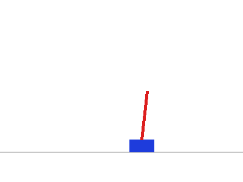
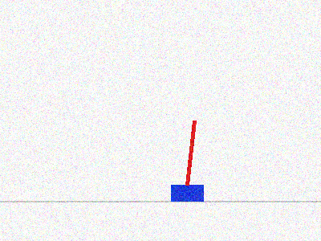
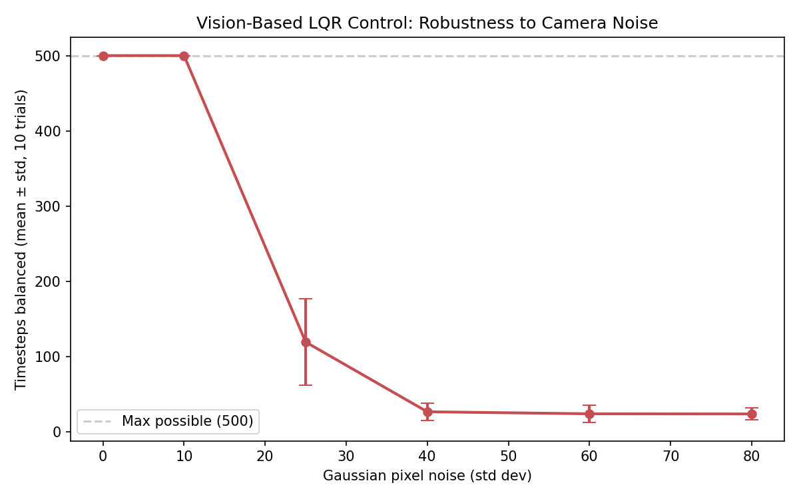

# Vision-Based Control of CartPole

**Question this project asks:** if a controller only has a camera, not
privileged access to the true state, how much does vision estimation
error degrade control performance — and at what point does it fail?

## Motivation

This is a direct follow-up to my [CartPole: Model-Based vs. Model-Free
Control](../cartpole-rl-control) project, extending it into robotic
**perception**: instead of giving the LQR controller the true state
`(x, x_dot, theta, theta_dot)`, the controller only sees a rendered
camera image and has to *estimate* the state from pixels using classical
computer vision — the same fundamental problem a real robot faces (no
sensor gives you perfect, privileged state).

This also connects to my MSc thesis background (CNN-based image
classification) by working on the image-processing side of a robotics
problem, using classical CV rather than a trained model — showing the
same visual-estimation problem can be approached without deep learning
when the target (a colored cart and pole) is well-defined enough.

## Pipeline

1. **Render** (`src/renderer.py`): the true physical state is rendered
   as a synthetic top-down camera frame — a blue rectangle (cart) and a
   red line (pole) — simulating what an overhead camera would see.

   

2. **Estimate** (`src/vision_estimator.py`): classical CV recovers state
   from the image alone:
   - Cart position: HSV color-threshold to isolate the blue region,
     take its pixel centroid, convert to meters using known camera
     calibration.
   - Pole angle: HSV color-threshold the red region, fit a line through
     the pixels with PCA (principal component analysis on the pixel
     coordinates), convert the line's direction to an angle.
   - Velocities (`x_dot`, `theta_dot`): estimated by **finite difference
     between consecutive frames** — a single image can't give you
     velocity, exactly like a real camera.

3. **Control** (`vision_control.py`): the LQR controller (from the
   first project) acts on this vision-estimated state instead of the
   true state, in closed loop with the real physics simulator.

## Experiment 1: Nominal vision vs. ground truth

With clean (noise-free) rendering, the vision pipeline is accurate to
within about 1cm / 0.01 radians — accurate enough that closed-loop
performance is **identical** to ground-truth state (both reach the
max 500 timesteps). This was a real, if unglamorous, first result: it
meant the interesting question wasn't "does vision work," but "how much
can the camera degrade before it stops working."

## Experiment 2: Robustness to camera noise

Gaussian pixel noise was added to each rendered frame before the CV
pipeline sees it, at increasing severity, to find the actual failure
point.


*Example frame at noise level 25 — the level where control performance
starts to collapse.*



**The result is a sharp threshold, not a gradual decline:** control is
essentially unaffected up to noise level 10, then collapses over a
narrow range to near-immediate failure by noise level 40. This kind of
cliff-edge behavior (rather than smooth degradation) makes intuitive
sense in hindsight: LQR's feedback gain amplifies whatever error is in
the state estimate, so once pixel noise pushes the *angle* estimate
(the PCA fit) far enough off, the controller starts actively
*pushing the pole over* based on a wrong estimate, rather than merely
reacting sluggishly to a correct one.

| Noise std dev | Mean timesteps balanced |
|---|---|
| 0 | 500.0 |
| 10 | 500.0 |
| 25 | 119.1 |
| 40 | 26.4 |
| 60 | 23.7 |
| 80 | 23.5 |

## Honest limitations

- **The vision pipeline is intentionally simple** (color thresholding +
  PCA), which only works because the cart/pole are drawn in flat,
  saturated colors with no background clutter. A real camera image
  (varying lighting, occlusion, complex backgrounds) would need a more
  robust pipeline — this project isolates the *control* question, not
  a general-purpose perception problem.
- **No filtering.** A real vision-based control system would typically
  run a Kalman filter (or similar) on the noisy state estimates to
  smooth them over time, rather than feeding raw per-frame estimates
  directly to the controller. Adding a Kalman filter and re-running the
  noise sweep is the natural next step — I'd expect it to push the
  failure threshold significantly higher.
- **Velocity via finite difference is noise-sensitive by construction**
  (differencing amplifies noise) — this is likely a major contributor to
  the sharp failure threshold, and a filter would help most here
  specifically.

## How to run

```bash
pip install numpy matplotlib scipy opencv-python pillow
python vision_control.py       # nominal vision vs. ground truth
python vision_robustness.py    # noise sweep, produces the threshold plot
```
